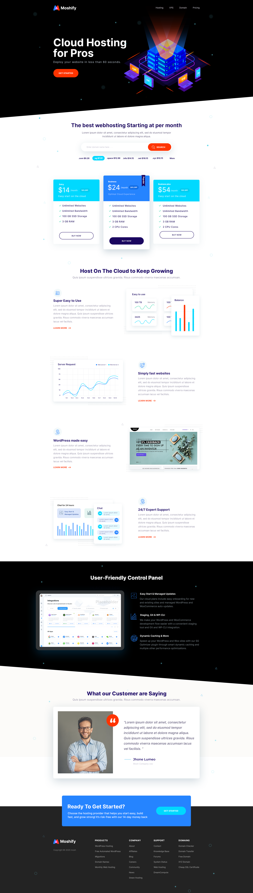

# 🌐 Moshify - Cloud Hosting Website

This project is a **fully responsive**, **fast-loading** website built for an imaginary cloud hosting company called **Moshify**. It showcases strong front-end development skills with a modern, mobile-first UI inspired by a professional Photoshop mockup.

 

## 🔗 Live Demo
👉 [Click here to view the website](https://khaledbenhafed.github.io/Moshify-Responsive-Cloud-Hosting-Website)  
*(Make sure to replace `your-repo-name` with the actual name of your GitHub repository)*

 

## 🖼️ Design Approach
- Designed using **Photoshop mockups** (mobile and desktop versions).
- Used a **component-based structure** to make the codebase scalable and maintainable.
- Focused on pixel-perfect implementation and responsiveness across all screen sizes.

 

## 🛠️ Tools & Technologies Used
- **VS Code** – Code editor  
- **HTML**, **CSS**, **JavaScript** – Core front-end technologies  
- **Photoshop** – Used for precise design measurement  
- **Google Chrome & DevTools** – For testing, debugging, and performance checks

 

## 🚀 Features
- ✅ Fully responsive layout (mobile-first design)
- ✅ Fast loading with performance-focused code
- ✅ Clean and organized structure using components
- ✅ UI/UX optimized for both small and large screens
- ✅ Semantic HTML and modern CSS techniques

 

## 📱 Web Design

### 🔻 Mobile Design

### 💻 Desktop Design

